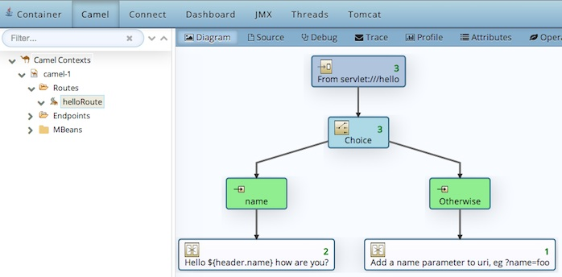

# Camel Servlet QuickStart

This example demonstrates how you can use a Servlet to expose a http
service in a Camel route. All of this runs on OpenShift with the [WildFly-Camel](https://github.com/wildfly-extras/wildfly-camel) integration. 

The Camel route is illustrated in the figure below. The
`servlet:hello` endpoint is listening for HTTP requests, and being
routed using the Content Based Router.

The request is being routed whether or not there is a HTTP query
parameter with the name `name`. A request where there
there is no `name` parameter, and Camel returns a message that
explains to the user, to add the parameter. With a request that
provides `?name=Kermit` in the HTTP url, Camel responses with a
greeting message. 

# Building this example

Building this quickstart builds and deploys the docker image on OpenShift

    mvn clean install
    
then access the URL that was assigned by the route

	http://war-camel-servlet-quickstart.apps.10.2.2.2.xip.io/war-camel-servlet    
